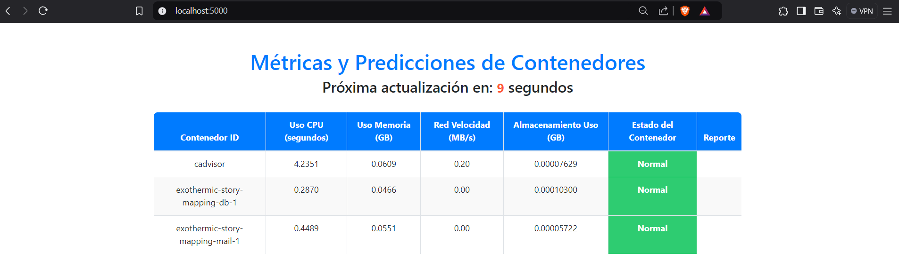

# practicas_unir

# Aplicativo de Monitoreo de Métricas y Predicciones de Contenedores

## Pasos de Ejecución

### 1. Clonar el repositorio e ingresamos al proyecto

```bash
git clone https://github.com/iamjosephreinoso/practicas_unir.git
```

Como ya tenemos clonado el repositorio desde GitHub en tu máquina local, ingresamos a la carpeta monitor_contenedores:

```bash
cd monitor_contenedores
```

### 2. Ejecutamos el Docker Compose

El archivo docker-compose.yml ya está configurado para iniciar los servicios necesarios: cAdvisor, Prometheus y la aplicación Flask. Para iniciar todos los servicios, ejecuta:

```bash
docker-compose up -d
```

Esto lanzará los siguientes servicios:

 - cAdvisor: Se ejecuta en el puerto 8080.

 - Prometheus: Se ejecuta en el puerto 9090.

 - Flask: Proporciona la interfaz gráfica en el puerto 5000.

### 3. Verificar el Funcionamiento

Para acceder y verificar que se esta realizando el monitoreo, verifique los servicios.

###cAdvisor

Accede a cAdvisor para verificar las métricas de los contenedores:

```bash
Ingresa: http://localhost:8080/metrics
```

###Prometheus

Accede a Prometheus para confirmar que las métricas están siendo recopiladas:

```bash
Accede a: http://localhost:9090 
```

En la pestaña Targets, asegúrate de que el objetivo cadvisor y flask_app esté en estado UP.

###Flask

Accede a la aplicación Flask para visualizar el monitoreo de las métricas

```bash
http://localhost:5000
```

Al ingresar a la URL en el puerto 5000 nos saldra una tabla monitoreando los contenedores de docker.


